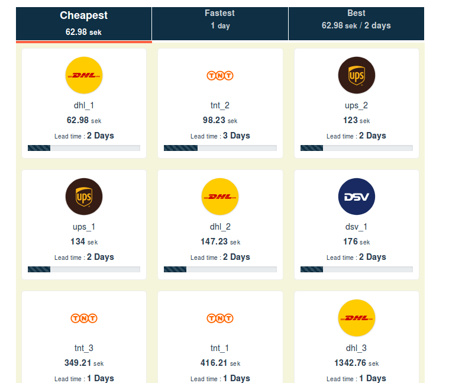

# product-shipping

> A Vue.js  + Webpack App 

## Synopsis

Functional requirements :
- Fetching the items from (products.JSON) and render them on the main page .
- Sorting products based on either the cheapest price or the fastest lead time.
- Getting products best deals (price/time Ratio) - Bonus

 

## Libraries used
* VueJs
* Webpack
* Sass
* Vue-router
* Bootstrap 4
* Express 4
* Jest
* Heroku 7

## Getting started

``` bash

git clone git@github.com:asmab/product-shipping.git

cd product-shipping

npm install

npm run dev 

```
serve with hot reload : Open [http://localhost:8080](http://localhost:8080)<br>

# build for production with minification
```
npm run build
```

## Running the tests
```
npm run unit
```

## Deployment : deploy to Heroku

1- Create a Heroku app.
```
heroku create <product-shipping>
```
2- Configure the project so that Heroku can serve up the vue code.
 Create server.js : [Express](https://expressjs.com/) script that Heroku can use to start a web server

```
npm run start
```

3- Push and deploy
 Add Heroku remote repository:
```
heroku git:remote --app <product-shipping> && git add . && git commit -a -m "commit message" && git push heroku master
```
